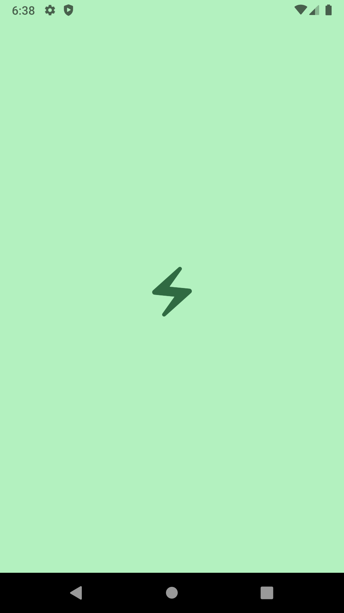
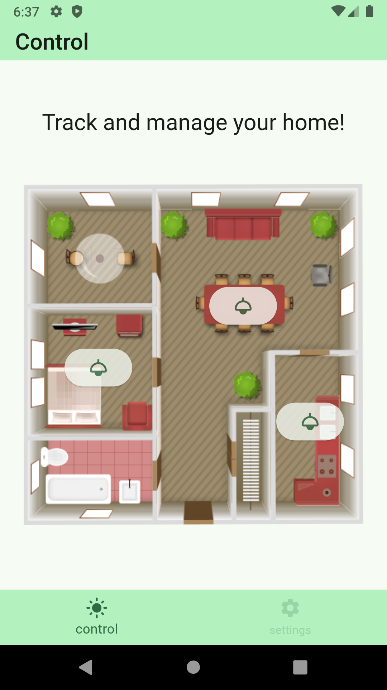
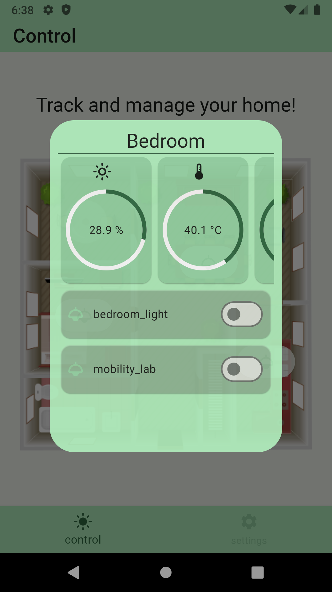
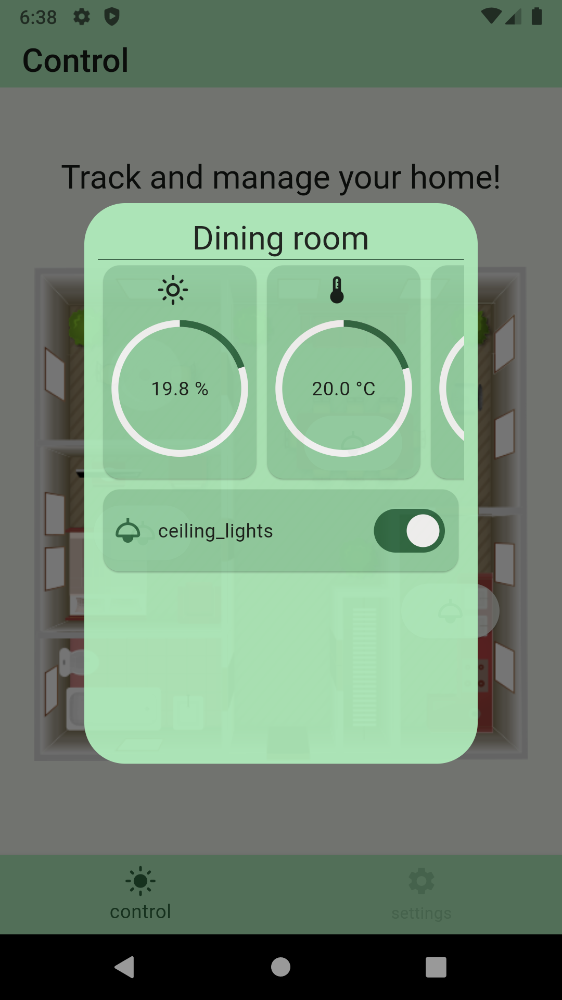
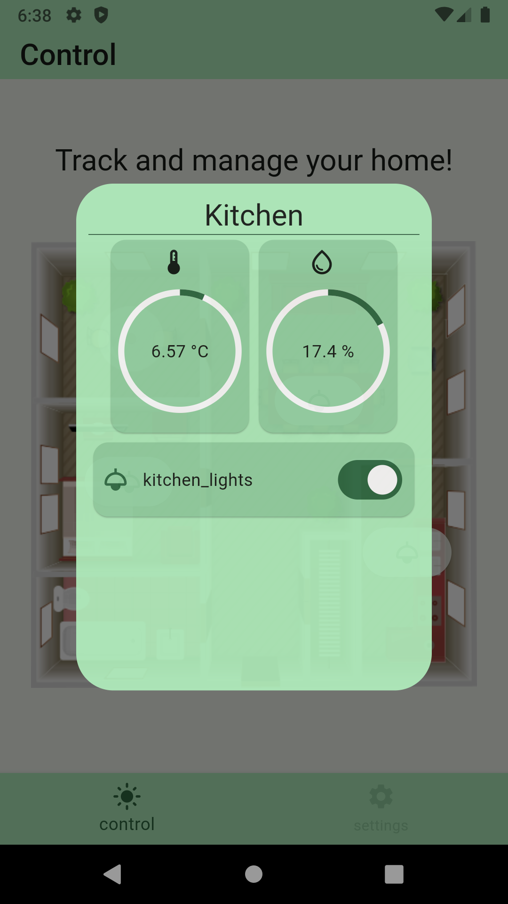
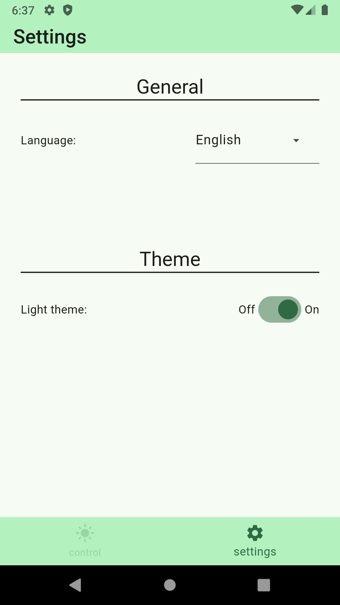
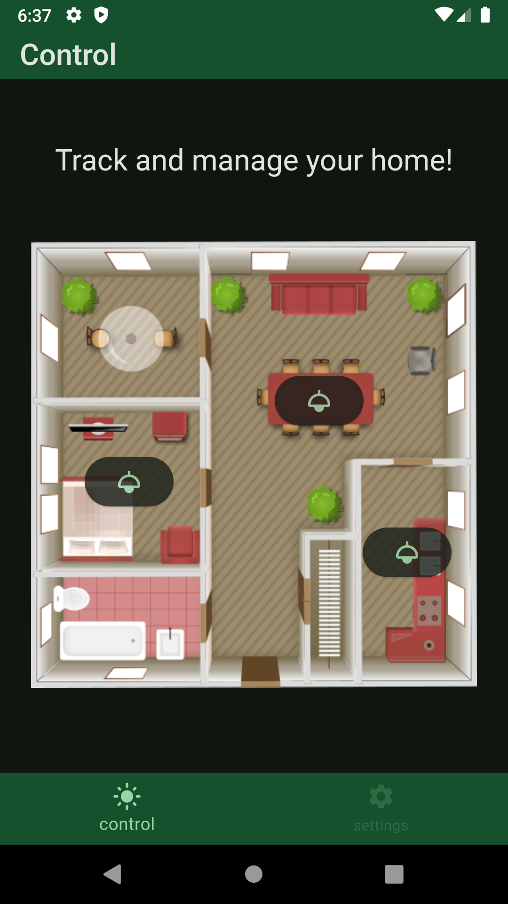
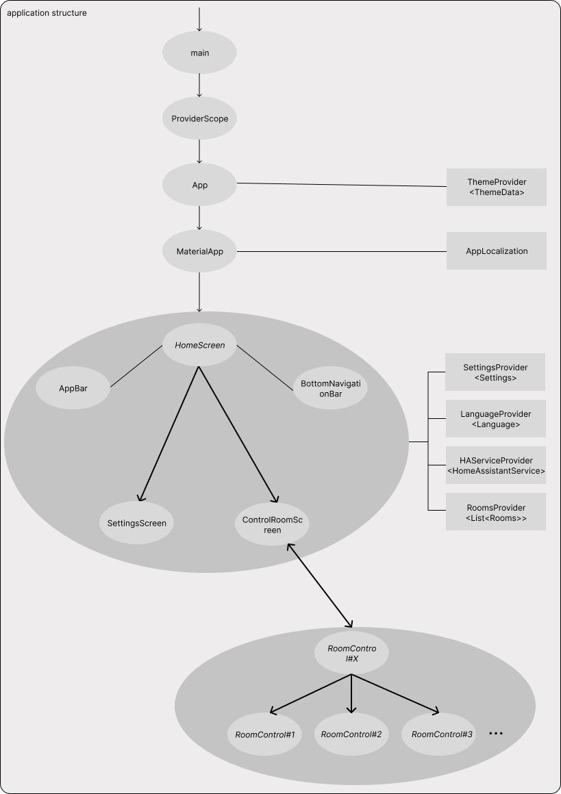

# luminar_control_app

## Setup

To install and run this app you need to install Flutter and Android Studio or VS Code editor.

- Flutter: [https://docs.flutter.dev/get-started/install](https://docs.flutter.dev/get-started/install).
- Android Studio: [https://developer.android.com/studio/install](https://developer.android.com/studio/install)

  - Create virtual device: [https://developer.android.com/studio/run/managing-avds](https://developer.android.com/studio/run/managing-avds)

- VS Code: [https://code.visualstudio.com/](https://code.visualstudio.com/)

## Run application in terminal

- start Android Virtual Device
- position yourself in project directory

  `cd <PROJECT_FOLDER>`

- run command to get required packages

  `flutter pub get`

- you have to create file lib/env/secret.dart and put your Home Assistant base url and [_Long Lived Access Token_](https://developers.home-assistant.io/docs/auth_api/#long-lived-access-token)

  - create class names _Secrets_ with 2 const variables:
    - haBaseUrl - your Home Assistant url
    - haLongLiveAccessToken - your _Long Lived Access Token_

- next, run application with

  `flutter run`

- if you have more than one AVD running, you will be asked to choose on which one you want your application to run, enter number of AVD and continue

- building will take some time, few minutes at least, after building is done, app will start automatically

 

## Application screens

 
 

<table align="center">
  <tr>
    <td>Loading screen</td>
    <td>Room screen</td>
  </tr>
  <tr>
    <td valign="top"></td>
    <td valign="top"></td>
  </tr>
 </table>

 

 

<table align="center">
  <tr>
    <td>Room#1 screen</td>
    <td>Room#2 screen</td>
    <td>Room#3 screen</td>
  </tr>
  <tr>
    <td valign="top"></td>
    <td valign="top"></td>
    <td valign="top"></td>
  </tr>
 </table>

 

 

<table align="center">
  <tr>
    <td>Settings screen</td>
    <td>Dark theme screen</td>
  </tr>
  <tr>
    <td valign="top"></td>
    <td valign="top"></td>
  </tr>
 </table>

  
  
  
  

## Project architecture

Simplified project architecture overview.

 

    
    
  

